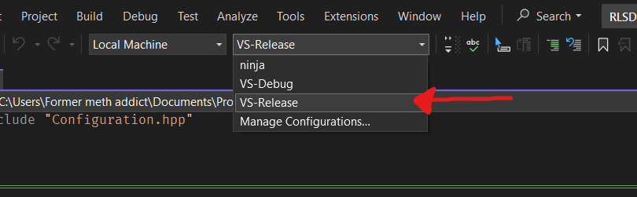

# RLSDK-generator
An SDK generator for Rocket League

Based on [CodeRed Generator](https://github.com/CodeRedModding/CodeRed-Generator) with classes from [this fork](https://github.com/matix2/UE3SDKGenerator) by matix2

## Usage
Customization should be done in `./src/Engine/RocketLeague/Configuration.cpp`

0. There is no `.sln` file. Open the project/repo folder in whatever IDE you want
   
1. In `Configuration.cpp`, change this to be the folder where you want the SDK generated:
   ```cpp
   std::filesystem::path GConfig::m_outputPathParentDir = "C:\\folder\\path\\where\\you\\want\\the\\SDK\\generated";
   ```

2. Change other values in `Configuration.cpp` if you want. For example, you can change these if you dont want timestamps:
    ```cpp
    bool GConfig::m_addTimestampToHeader           = true;
    bool GConfig::m_addTimestampToOutputFolderName = true;
    ```
   You can also change this if you dont want a copy of RLSDK with pch includes in all `.cpp` files:
   ```cpp
   bool GConfig::m_createPchCopy = true;
   ```
3. Build the project. (Requires the MSVC toolchain, which you should already have if you installed Visual Studio)
    - If using Visual Studio, you should be able to select a cmake build preset at the top:
      
      

      Select `VS-Release` (unless you're trying to debug stuff or use a different generator like Ninja).
    - If using another editor like VS Code, you will need [CMake](https://cmake.org/download) (and I'd suggest the [CMake Tools](https://marketplace.visualstudio.com/items?itemName=ms-vscode.cmake-tools) extension). If not using the CMake Tools extension for VS Code, you'll need to run this script before configuring/building with cmake
        ```
        C:\Program Files\Microsoft Visual Studio\2022\Community\VC\Auxiliary\Build\vcvars64.bat
        ```
    The output binaries will be in `./x64/<build configuration>`

4. Inject `CodeRedGenerator.dll` into Rocket League and your SDK should begin generating
   - Some notable DLL injectors:
     - [Xenos](https://github.com/DarthTon/Xenos)
     - [Extreme Injector](https://github.com/master131/ExtremeInjector)
     - [ItsBranK's Library Loader](https://github.com/ItsBranK/LibraryLoader)
